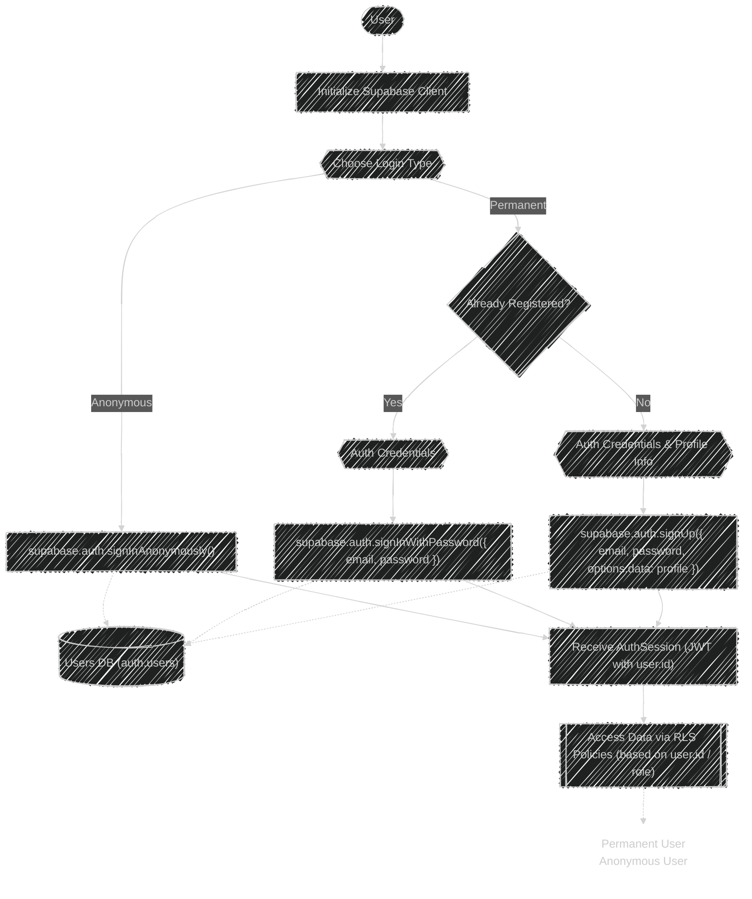

```mermaid
---
config:
  look: handDrawn
  theme: dark
---
flowchart TD
  Start(["User"]) --> InitClient["Initialize Supabase Client"]
  InitClient --> ChooseMode{{"Choose Login Type"}}

  ChooseMode -->|Anonymous| AnonLogin["supabase.auth.signInAnonymously()"]
  ChooseMode -->|Permanent| AuthOrSignup{"Already Registered?"}

  AuthOrSignup -->|Yes| SignInCredentials{{"Auth Credentials"}}
  SignInCredentials --> AuthLogin["supabase.auth.signInWithPassword({ email, password })"]
  AuthOrSignup -->|No| SignUpCredentials{{"Auth Credentials & Profile Info"}}
  SignUpCredentials --> SignUp["supabase.auth.signUp({ email, password, options.data: profile })"]

  AnonLogin -.-> UserDB[("Users DB (auth.users)")]
  AuthLogin -.-> UserDB
  SignUp -.-> UserDB

  AnonLogin --> Session["Receive AuthSession (JWT with user.id)"]
  AuthLogin --> Session
  SignUp --> Session

  Session --> AccessByLevels[["Access Data via RLS Policies (based on user.id / role)"]]

  AccessByLevels -.-> AccessModes["Permanent User
                                  Anonymous User"]

  style AccessModes fill:none,stroke:none
```
