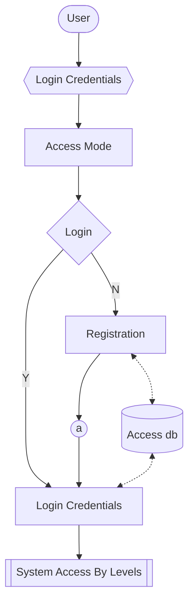

```mermaid
flowchart TD
  Start(["User"]) --> ProcessCredentials{{"Login Credentials"}}
  ProcessCredentials --> AccessMode["Access Mode"]
  AccessMode --> Login{"Login"}
  Login -- N --> Registration["Registration"]
  Registration --> a(("a"))
  Registration <-.-> AccessDB[("Access db")]
  Login -- Y --> LoginCredentials["Login Credentials"]
  a --> LoginCredentials
  AccessDB <-.-> LoginCredentials
  LoginCredentials --> AccessByLevels[["System Access By Levels"]]
```
