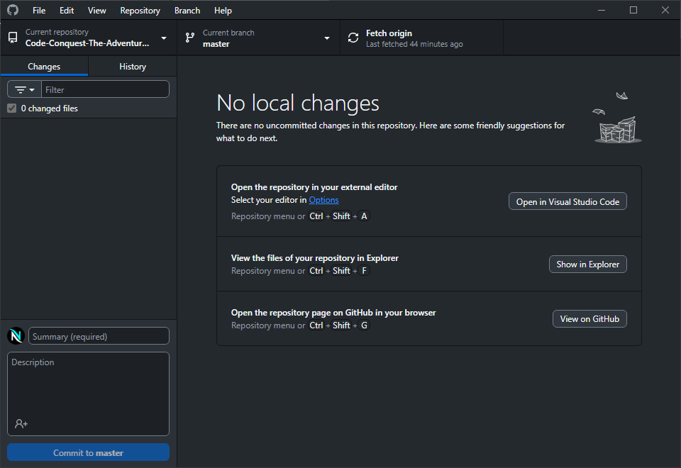

# Git

Using `git` can be hard to use, this guide shows the alternative to use git using Github Desktop.

# Installing and Setup Github Desktop

Download **Github Desktop** from [Github Desktop](https://desktop.github.com/download/) website.

> The "Download for Windows (64bit)" is a huge button, just click it to download, and wait for it to finished.

Launch the downloaded file, it should automatically install **Github Desktop**.

Go to Desktop, you should see the app named **Github Desktop** there, double click it to launch.

> If you can't find it, just press Win key and search for "Github Desktop".

After it launches, click "Sign in to Github.com", your browser should open and just login your github account.

After login, **Github Desktop** should show again, with the texts saying "Configure Git".

Just click **Finish**.

After that, you should see "Let's get started!", find "Add an Existing Repository from your local drive...", click it, and click "choose".

A window should pop up, find the "Code Conquest - The Adventure Game" folder inside the "Desktop" folder, and click "Select Folder".

After clicking "Select Folder", click "Add repository".

After that, you should see this:

This will be the alternative way to open vscode while inside "Code Conquest - The Adventure Game" folder.

When you want to code now, you can always just open "Github Desktop" and click "Open in Visual Studio Code".
